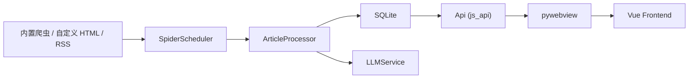

# MicroFlow

MicroFlow 是一款面向校园信息场景的本地桌面阅读与订阅应用。它把校内通知、公文通、学院站点以及用户自定义的 RSS / HTML 数据源聚合到一个本地客户端中，并结合 AI 完成摘要、标签提取、Markdown 重排与阅读增强，帮助用户更快完成“发现信息、理解重点、保存与分享”的闭环。

当前仓库仍处于持续开发阶段。仓库内版本基线为 `v1.0.0`，但这并不代表项目已经进入接口冻结、数据结构稳定和长期兼容承诺的正式发布阶段。

最后更新：2026-04-01

## 项目定位

MicroFlow 主要解决以下几类问题：

- 校园信息分散在多个站点和栏目中，日常需要反复切换页面才能确认是否有新通知。
- 许多通知篇幅长、结构杂，真正重要的信息需要二次提炼。
- 用户往往只关心部分来源，希望按来源、阅读状态和个人偏好筛选内容。
- 校内信息、外部 RSS 和自定义网页订阅缺少统一入口。

项目强调 `local-first` 体验：本地运行、本地存储、本地配置，前端界面通过 `pywebview` 直接加载本地静态资源，不依赖独立的前端构建服务即可启动。

## 核心能力

### 1. 校园多源聚合

- 内置多组校园信息源抓取器，覆盖公文通与多个学院/栏目站点。
- 支持统一调度、增量抓取、按时间排序、来源筛选和分页加载。
- 支持搜索、未读统计、收藏、软删除和首条未读定位。

### 2. 自定义数据源

- 支持新增自定义 HTML 网页规则与 RSS/Atom 订阅规则。
- HTML 规则支持 AI 分析页面结构并生成 CSS 选择器。
- 支持 `GET / POST`、自定义请求头、Cookie / 登录态、请求体配置。
- 支持单页、下一页、页码模板、加载更多等多种分页模式。
- 支持列表页提取、详情页提取、混合正文策略和浏览器兜底抓取。
- 支持规则预览、测试、保存、启停、删除、版本回滚、导入导出与健康状态汇总。

### 3. RSS 阅读与标准化

- 支持 RSS 1.0、RSS 2.0、Atom。
- 对 RSS 内容做标准化处理，提取正文、图片、附件、结构化块和 Markdown。
- 当 feed 仅提供摘要时，可自动回源详情页补全正文。
- 支持原始、增强、摘要三种阅读模式。
- 支持源级策略与模板默认值，适配资讯类、长文类、图文类等不同内容形态。
- 支持 RSS AI 结果缓存复用与长文分块摘要，降低重复请求和超时风险。

### 4. AI 内容增强

- 支持任意 OpenAI 兼容 API 服务。
- 可配置 `Base URL`、`API Key`、`Model Name`。
- 支持文章总结、标签提取、Markdown 重排。
- 支持按来源配置 AI 排版开关、摘要开关和独立提示词。
- 支持手动重新生成结果、取消 AI 任务与缓存命中复用。
- 支持多模型配置，用于规则生成等辅助场景。

### 5. 阅读与整理体验

- 详情页支持结构化内容展示、附件下载、图片预览与站内查看。
- 支持正文批注能力，按阅读模式保存和管理批注。
- 支持文章截图导出、复制图片到剪贴板和分享操作。
- 支持邮件推送配置、测试发送和最新文章推送诊断。

### 6. 桌面端与系统能力

- 使用 `pywebview` 作为桌面壳层，前后端通过 `js_api` 通信。
- 支持系统托盘、未读红点、免打扰、窗口置顶、隐藏到托盘、启动最小化。
- 支持开机自启、网络状态检测、启动检查、软件更新检查。
- 支持本地字体导入与主题/阅读偏好配置。
- 已接入可关闭的匿名遥测与错误上报能力，用于稳定性分析。

## 适用场景

- 追踪校内通知、公文和学院动态，减少重复登录多个站点的成本。
- 为实验室、团队或个人维护统一的信息订阅面板。
- 将外部 RSS 博客、资讯源与校园公告放在同一个阅读器中处理。
- 用 AI 快速提炼长通知中的时间、地点、对象、动作和执行要求。

## 架构概览



核心链路说明：

- `src/spiders/` 负责内置校园源、自定义 HTML 规则和 RSS 规则的抓取。
- `src/core/scheduler.py` 负责调度、限流、增量更新和来源级结果汇总。
- `src/core/article_processor.py` 负责异步正文处理、AI 任务编排和回调通知。
- `src/database.py` 采用 SQLite WAL、读连接池和串行写队列管理本地数据。
- `src/api.py` 作为桌面前后端桥接层，暴露历史列表、详情、配置、规则与系统能力。
- `frontend/` 使用 Vue 3 运行时脚本直接驱动本地静态页面，无需额外构建步骤。

## 技术栈

- Python
- pywebview
- SQLite
- requests
- BeautifulSoup + lxml
- feedparser
- OpenAI 兼容 API
- Vue 3
- marked
- EasyMDE
- html2canvas
- PyInstaller

## 快速开始

### 运行环境

- Python 3.10+
- macOS 为当前主开发与主验证环境，Apple Silicon 支持最完整
- Windows 有安装说明与适配逻辑，Linux 目前更接近实验性支持
- 内置校园源通常需要校园网或校内访问环境；公网 RSS / 自定义源依赖较低
- 如需启用 AI 功能，需要准备可用的 OpenAI 兼容接口

### 安装依赖

```bash
python3 -m venv .venv
source .venv/bin/activate
pip install -r requirements.txt
```

### 启动应用

```bash
python main.py
```

启动后，桌面窗口会通过 `pywebview` 加载本地前端页面。当前前端不需要单独执行 `npm install` 或 `npm run build`。

### 首次使用建议

1. 在设置中配置 AI 接口信息：`Base URL`、`API Key`、`Model Name`。
2. 勾选需要关注的内置来源。
3. 按需新增自定义 HTML 数据源或 RSS 订阅源。
4. 如需通知或外发，可继续配置邮件推送、托盘提醒和阅读偏好。

## 数据与持久化

应用默认把数据写入系统级应用目录，而不是仓库目录。

- macOS: `~/Library/Application Support/MicroFlow/data`
- Windows: `%APPDATA%/MicroFlow/data`
- Linux: `~/.local/share/MicroFlow/data`

常见持久化文件：

- `config.json`：应用配置
- `MicroFlow.db`：本地数据库
- `custom_spiders_rules.json`：自定义规则
- `microflow.log`：运行日志

数据库当前主要保存以下内容：

- 文章基础信息与来源元数据
- 已读、收藏、软删除状态
- 原始正文、增强 Markdown、AI 摘要和标签
- 结构化内容块、图片资产、附件信息
- 正文批注
- AI 结果缓存与匿名遥测事件队列

## 项目结构

```text
MicroFlow/
├── main.py                       # 桌面应用入口、窗口与托盘管理
├── frontend/                     # 本地前端静态资源
│   ├── index.html                # 主界面
│   ├── js/app.js                 # 前端核心逻辑
│   ├── css/                      # 主题与样式
│   ├── icons/                    # 图标资源
│   └── libs/                     # 本地前端依赖
├── src/
│   ├── api.py                    # 前后端桥接 API
│   ├── database.py               # SQLite 管理与迁移
│   ├── llm_service.py            # AI 服务封装
│   ├── core/                     # 调度、守护进程、文章处理、路径管理
│   ├── services/                 # 配置、下载、遥测、规则生成等服务
│   ├── spiders/                  # 内置爬虫、动态 HTML 爬虫、RSS 爬虫
│   ├── models/                   # 规则模型
│   └── utils/                    # 日期、文本、RSS、AI Markdown 等工具
├── tests/                        # 自动化测试
├── docs/                         # 安装、设计与专项进度文档
├── data/                         # 仓库内静态数据资源
├── requirements.txt              # Python 依赖
├── MicroFlow.spec                # PyInstaller 打包配置
└── README.md
```

## 测试与校验

默认测试入口：

```bash
pytest -q
```

当前 `pytest.ini` 已限制默认只收集 `tests/` 目录下的测试文件。

如需额外执行轻量校验，可使用：

```bash
node --check frontend/js/app.js
python3 -m py_compile src/api.py src/database.py
```

## 打包

仓库已包含打包配置：

```bash
python3 scripts/build_release_icons.py
pyinstaller MicroFlow.spec
```

当前仓库包含两套主要打包入口：

- macOS：`MicroFlow.spec`
- Windows：`MicroFlow.windows.spec`

完整打包流程、图标生成、DMG / Inno Setup 命令可参考：

- [打包指南](docs/PACKAGING_GUIDE.md)

- [macOS 安装说明](docs/INSTALL_MACOS.md)
- [Windows 安装说明](docs/INSTALL_WINDOWS.md)

## 相关文档

- [项目阶段清单](docs/PROJECT_CHECKLIST.md)
- [RSS 功能进度记录](docs/RSS_PROGRESS.md)
- [HTML AI 爬虫使用手册](docs/HTML_CRAWLER_MANUAL.md)
- [匿名统计与遥测方案](docs/TELEMETRY_PLAN.md)
- [版本号与更新日志策略](docs/VERSIONING_POLICY.md)
- [更新日志](CHANGELOG.md)

## 当前状态与注意事项

- 项目仍处于开发阶段，功能边界和 UI 仍可能继续调整。
- 当前数据库结构仍允许演进，现阶段优先保证开发效率，而非历史数据的长期兼容性。
- 内置校园源大量依赖校园网环境，离开校内网络后可能只能使用 RSS 和公网自定义源。
- 桌面安装包目前仍可能受代码签名、公证和系统安全策略影响，安装时请结合对应平台安装文档使用。

如果你希望把这个仓库作为后续协作或对外展示的主入口，这份 README 已经可以作为项目首页文档继续维护；后续功能、安装方式或测试入口发生明显变化时，建议同步更新本文件。
